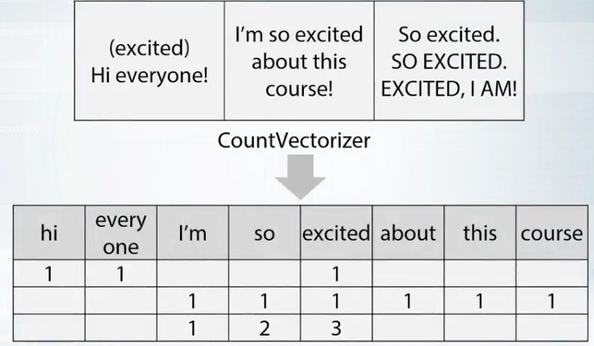
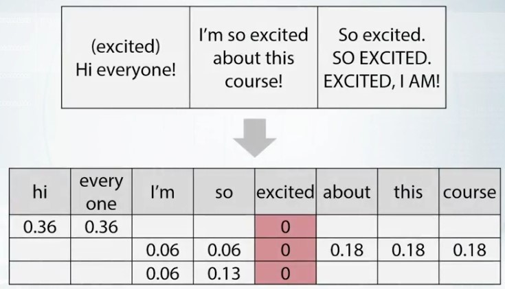

<h1>Table of Contents<span class="tocSkip"></span></h1>
<div class="toc"><ul class="toc-item"><li><span><a href="#Recap-of-ML-algorithms" data-toc-modified-id="Recap-of-ML-algorithms-1"><span class="toc-item-num">1&nbsp;&nbsp;</span>Recap of ML algorithms</a></span><ul class="toc-item"><li><span><a href="#Conclusion" data-toc-modified-id="Conclusion-1.1"><span class="toc-item-num">1.1&nbsp;&nbsp;</span>Conclusion</a></span></li></ul></li><li><span><a href="#Software/Hardward-Requirements" data-toc-modified-id="Software/Hardward-Requirements-2"><span class="toc-item-num">2&nbsp;&nbsp;</span>Software/Hardward Requirements</a></span><ul class="toc-item"><li><span><a href="#Hardware" data-toc-modified-id="Hardware-2.1"><span class="toc-item-num">2.1&nbsp;&nbsp;</span>Hardware</a></span></li><li><span><a href="#Cloud-resources" data-toc-modified-id="Cloud-resources-2.2"><span class="toc-item-num">2.2&nbsp;&nbsp;</span>Cloud resources</a></span></li><li><span><a href="#Conclusion" data-toc-modified-id="Conclusion-2.3"><span class="toc-item-num">2.3&nbsp;&nbsp;</span>Conclusion</a></span></li></ul></li><li><span><a href="#Feature-preprocessing-and-generation-with-respect-to-models" data-toc-modified-id="Feature-preprocessing-and-generation-with-respect-to-models-3"><span class="toc-item-num">3&nbsp;&nbsp;</span>Feature preprocessing and generation with respect to models</a></span><ul class="toc-item"><li><span><a href="#Numeric-features" data-toc-modified-id="Numeric-features-3.1"><span class="toc-item-num">3.1&nbsp;&nbsp;</span>Numeric features</a></span><ul class="toc-item"><li><span><a href="#Preprocessing:-scaling" data-toc-modified-id="Preprocessing:-scaling-3.1.1"><span class="toc-item-num">3.1.1&nbsp;&nbsp;</span>Preprocessing: scaling</a></span></li><li><span><a href="#Preprocessing:-outliers" data-toc-modified-id="Preprocessing:-outliers-3.1.2"><span class="toc-item-num">3.1.2&nbsp;&nbsp;</span>Preprocessing: outliers</a></span></li><li><span><a href="#Preprocessing:-rank" data-toc-modified-id="Preprocessing:-rank-3.1.3"><span class="toc-item-num">3.1.3&nbsp;&nbsp;</span>Preprocessing: rank</a></span></li><li><span><a href="#Preprocessing-for-neural-networks" data-toc-modified-id="Preprocessing-for-neural-networks-3.1.4"><span class="toc-item-num">3.1.4&nbsp;&nbsp;</span>Preprocessing for neural networks</a></span></li><li><span><a href="#Feature-generation" data-toc-modified-id="Feature-generation-3.1.5"><span class="toc-item-num">3.1.5&nbsp;&nbsp;</span>Feature generation</a></span></li><li><span><a href="#Conclusion" data-toc-modified-id="Conclusion-3.1.6"><span class="toc-item-num">3.1.6&nbsp;&nbsp;</span>Conclusion</a></span></li></ul></li><li><span><a href="#Categorical-and-ordinal-features" data-toc-modified-id="Categorical-and-ordinal-features-3.2"><span class="toc-item-num">3.2&nbsp;&nbsp;</span>Categorical and ordinal features</a></span><ul class="toc-item"><li><span><a href="#Categorial" data-toc-modified-id="Categorial-3.2.1"><span class="toc-item-num">3.2.1&nbsp;&nbsp;</span>Categorial</a></span></li><li><span><a href="#Ordinal-features" data-toc-modified-id="Ordinal-features-3.2.2"><span class="toc-item-num">3.2.2&nbsp;&nbsp;</span>Ordinal features</a></span></li><li><span><a href="#Label-encoding" data-toc-modified-id="Label-encoding-3.2.3"><span class="toc-item-num">3.2.3&nbsp;&nbsp;</span>Label encoding</a></span></li><li><span><a href="#Frequency-encoding" data-toc-modified-id="Frequency-encoding-3.2.4"><span class="toc-item-num">3.2.4&nbsp;&nbsp;</span>Frequency encoding</a></span></li><li><span><a href="#Categorical-features" data-toc-modified-id="Categorical-features-3.2.5"><span class="toc-item-num">3.2.5&nbsp;&nbsp;</span>Categorical features</a></span></li><li><span><a href="#Conclusion" data-toc-modified-id="Conclusion-3.2.6"><span class="toc-item-num">3.2.6&nbsp;&nbsp;</span>Conclusion</a></span></li></ul></li><li><span><a href="#Datetime-and-coordinates" data-toc-modified-id="Datetime-and-coordinates-3.3"><span class="toc-item-num">3.3&nbsp;&nbsp;</span>Datetime and coordinates</a></span><ul class="toc-item"><li><span><a href="#Date-and-time" data-toc-modified-id="Date-and-time-3.3.1"><span class="toc-item-num">3.3.1&nbsp;&nbsp;</span>Date and time</a></span></li><li><span><a href="#Coordinates" data-toc-modified-id="Coordinates-3.3.2"><span class="toc-item-num">3.3.2&nbsp;&nbsp;</span>Coordinates</a></span></li><li><span><a href="#Conclusion" data-toc-modified-id="Conclusion-3.3.3"><span class="toc-item-num">3.3.3&nbsp;&nbsp;</span>Conclusion</a></span></li></ul></li><li><span><a href="#Handling-missing-values" data-toc-modified-id="Handling-missing-values-3.4"><span class="toc-item-num">3.4&nbsp;&nbsp;</span>Handling missing values</a></span><ul class="toc-item"><li><span><a href="#Hideen-NaNs" data-toc-modified-id="Hideen-NaNs-3.4.1"><span class="toc-item-num">3.4.1&nbsp;&nbsp;</span>Hideen NaNs</a></span></li><li><span><a href="#Fillna-approaches" data-toc-modified-id="Fillna-approaches-3.4.2"><span class="toc-item-num">3.4.2&nbsp;&nbsp;</span>Fillna approaches</a></span></li><li><span><a href="#Feature-generation-with-missing-values" data-toc-modified-id="Feature-generation-with-missing-values-3.4.3"><span class="toc-item-num">3.4.3&nbsp;&nbsp;</span>Feature generation with missing values</a></span></li><li><span><a href="#Treating-values-which-do-not-present-in-traind-data" data-toc-modified-id="Treating-values-which-do-not-present-in-traind-data-3.4.4"><span class="toc-item-num">3.4.4&nbsp;&nbsp;</span>Treating values which do not present in traind data</a></span></li><li><span><a href="#Conclusion" data-toc-modified-id="Conclusion-3.4.5"><span class="toc-item-num">3.4.5&nbsp;&nbsp;</span>Conclusion</a></span></li></ul></li><li><span><a href="#Additional-Materials" data-toc-modified-id="Additional-Materials-3.5"><span class="toc-item-num">3.5&nbsp;&nbsp;</span>Additional Materials</a></span><ul class="toc-item"><li><span><a href="#Feature-preprocessing" data-toc-modified-id="Feature-preprocessing-3.5.1"><span class="toc-item-num">3.5.1&nbsp;&nbsp;</span>Feature preprocessing</a></span></li><li><span><a href="#Feature-generation" data-toc-modified-id="Feature-generation-3.5.2"><span class="toc-item-num">3.5.2&nbsp;&nbsp;</span>Feature generation</a></span></li></ul></li></ul></li><li><span><a href="#Feature-extraction-from-text-and-images" data-toc-modified-id="Feature-extraction-from-text-and-images-4"><span class="toc-item-num">4&nbsp;&nbsp;</span>Feature extraction from text and images</a></span><ul class="toc-item"><li><span><a href="#Bag-of-words" data-toc-modified-id="Bag-of-words-4.1"><span class="toc-item-num">4.1&nbsp;&nbsp;</span>Bag of words</a></span><ul class="toc-item"><li><span><a href="#Bag-of-words" data-toc-modified-id="Bag-of-words-4.1.1"><span class="toc-item-num">4.1.1&nbsp;&nbsp;</span>Bag of words</a></span></li><li><span><a href="#Bag-of-words:-TFiDF" data-toc-modified-id="Bag-of-words:-TFiDF-4.1.2"><span class="toc-item-num">4.1.2&nbsp;&nbsp;</span>Bag of words: TFiDF</a></span></li><li><span><a href="#N-grams" data-toc-modified-id="N-grams-4.1.3"><span class="toc-item-num">4.1.3&nbsp;&nbsp;</span>N-grams</a></span></li><li><span><a href="#Texts-preprocessing" data-toc-modified-id="Texts-preprocessing-4.1.4"><span class="toc-item-num">4.1.4&nbsp;&nbsp;</span>Texts preprocessing</a></span></li><li><span><a href="#Texts-preprocessing:-lemmatization-and-stemming" data-toc-modified-id="Texts-preprocessing:-lemmatization-and-stemming-4.1.5"><span class="toc-item-num">4.1.5&nbsp;&nbsp;</span>Texts preprocessing: lemmatization and stemming</a></span></li><li><span><a href="#Conclusion" data-toc-modified-id="Conclusion-4.1.6"><span class="toc-item-num">4.1.6&nbsp;&nbsp;</span>Conclusion</a></span></li></ul></li></ul></li></ul></div>


```python
import pandas as pd
import numpy as np
import matplotlib.pyplot as plt
```

# Recap of ML algorithms

- LInear Model
    - Split space into two-spaces separated by a hyper-plane
    - Logitic Regression or SVM
        - They are all Linear Models with different loss functions
    - Good for sparse high dimensional data
    - Limitation : point cannot be separated by such a simple approach
- Tree-based
    - Use decision tress as a basic block for building more complicated models
    - Random forest, Gradient Boosted Decision Tree
    - A good default method for tabular data
    - Hard to capture linear dependencies since it requires a lot of splits
    - Scikit-learn : RF
    - XGBoost, LightGBM : GBDT
- kNN
    - Closer objects will likely to have same labels
    - Features based on nearest neighbors are often verey informative
- Neural Networks
    - Produce a smmoth separating curve in contrast to decision trees
    

- No Free Lunch Theorem
    - Here is no method which outperforms all others for all tasks
    - For every method we can construct a task for which this particular method will not be the best
- The most powerful methods are GBDT and NN, but we shouldn't underestimate Linear Models and k-NN becuase sometimes, they may be better

## Conclusion

- There is no "silver buulet" algorithm
- Linear models split space into 2 subspaces
- Tree-based methods splits space into boxes
- k-NN methods heavy rely on how to measure points "closeness"
- Feed-forward NNs produce smooth non-linear decision boundary

# Software/Hardward Requirements

## Hardware

- Most of competitions (except image-based) can be solved on:
    - HIgh-level laptop
    - 16+ gb ram
    - 4+ cores
- Quite good setup:
    - Tower PC
    - 32+ gb ram
    - 6+ cores

- RAM
    - If you can keep data in memory ─ everythin gwill be much easier
- Cores
    - More cores you have ─ more (or faster) experiments you can do
- Storage
    - SSD is crucial if you work with images or big datasets with a lot of small pieces

## Cloud resources

Cloud platforms can provide you with a computational resources

There are several cloud options:
- Amazon AWS
- Microsoft Azure
- Google Cloud : Cheapest

## Conclusion

- Anaconda works out-of-box**
- Proposed setup is not the only one, but most common**
- Don't overestimate role of hardward/software**

# Feature preprocessing and generation with respect to models

## Numeric features

### Preprocessing: scaling

there are models with do and don't depend of feature scale. Tree-based models do not depend on feature scale, while k-NN, linear models, and neural network depend of feature scale

differnet features scalings result in different models quality. In this sense, it is just another hyper-parameter you need to optimize. The easiest way to do this is to rescale all features to the same scale.

1. To [0,1]
    - sklearn.prerpocessing.MinMaxScaler
2. To mean=0, std=1
    - sklearn.preprocessing.StandardScaler

### Preprocessing: outliers

Outliers influence model traning results of Linear Models. To protect linear models from outliers, we can clip features values between two chosen values of lower bound and upper bound

***winsorization***

calculate lower bound and upper bound values as features values at first and 99s percentils and clip the features values

### Preprocessing: rank

- set spaces between proper assorted values to be equal
- can be a better option than MinMaxScaler if we have outliers
- Linear models, KNN, and neural networks can benefit from this kind of transformation if we have no time to handle ouliers manually
- You need to store the creative mapping from features values to their rank values
    - Alternatively, you can concatenate, train and test data before applying the rank transformation

### Preprocessing for neural networks

1. Log transform:
    - np.log(1 + x)


2. Raising to the power < 1:
    - np.sqrt(x + 2/3)

drive too big values closer to the features' average value and the values near zero are becoming a bit more distinguishable

**It is beneficial to train a model on concatenated data frames produced by different preprocessings, or to mix models training differently-preprocessed data**

    Linear models, KNN, and neural networks can benefit hugely from this

### Feature generation

Wyas to proceed:
- prior knowledge
- EDA

Feature generation is a process of creating new features using knowledge about the features and the task. It helps us by making model training more simple and effective. Sometimes, we can engineer these features using prior knowledge and logic.

Sometimes we have to dig into the data, create and check hypothesis, and use this derived knowledge and our intuition to derive new features

It is useful to know that adding, multiplications, divisions, and other features interactions can be of help not only for linear models, but also for tree-based models

### Conclusion

1. Numeric feature preprocessing is different for tree and non-tree models:

    a. Tree-based models doesn't depend on scaling
    
    b. Non-tree-based models hugey depend on scaling
    
    
2. Most often used preprocessings are:

    a. MinMaxScaler - to [0,1]
    
    b. StandardScaler - to mean==0, std==1
    
    c. Rank - sets spaces between sorted values to be equal
    
    d. np.log(1+x) and np.sqrt(1+x)
    
    
3. Feature generation is powered by:

    a. Prior knowledge
    
    b. Exploratory data analysis
    

## Categorical and ordinal features

### Categorial

- nominal : male, female
- ordinal : 1, 2, 3 
    - difference between (2 - 1) and (3 - 2) not equal

### Ordinal features

- Ticket class: 1, 2, 3
- Driver's license: A, B, C, D
- Education: kindergarden, school, undergraduate, bachelor, master, doctoral

### Label encoding

The simplest way to encode a categorical feature is to map it's unique values to different numbers. people referred to this procedure as **label encoding**. This method works fine with trees because tree-methods can split features, and extract mos tof the useful values in categories on its own. Non-tree-based-models, on the other side, usually can't use this feature effectively

- Alphabetical(sorted)
    - [S,C,Q] -> [2,1,3]
    - sklearn.preprocessing.LabelEncoder


- Order of appearance
    - [S,C,Q] -> [1,2,3]
    - Pandas.factorize

### Frequency encoding

- encode this feature via mapping values to their frequencies
- if frequency of category is correlated with target value, linear model will utilize this dependency
- can help both lienar and tree models
- if you have multiple categories with the same frequency
    - from scipy.stats import rankdata

### Categorical features

- One-hot encoding
    - pandas.get_dummies
    - works well for linear methods, kNN, neural networks
    - already scaled
    - can become difficult for tree-methods


- feature generation
    - feature interaction between several cateogrical features
    - usually useful for non-tree-based models namely, linear model, kNN

### Conclusion

1. Values in ordinal features are sorted in some meaningful order


2. Label encoding maps categories to numbers


3. Frequency encoding maps categories to their frequencies


4. Label and Frequency encodings are often used for tree-based models


5. One-hot encoding is often used for non-tree-based models


6. Interactions of categorical features can help linear models and KNN

## Datetime and coordinates

### Date and time

1. time moments in a period
    - Day number in week, month, season, year, second, minute, hour
    
    
2. time passed since particular event
    1. Row-independent moment : since 00:00:00 UTC, 1 January 1970
    2. Row-dependent important moment : Number of days left until next holidays/time passed after last holiday.
    
    
3. Difference between dates

after generation feature is from date time, you usually will get either numeric features or categorical features. And these features now are need to be treated accordingly with necessary pre-processing we have discussed earlier.

### Coordinates

Generally, you can calculate distances to important points on the map

- if you have additional data with infrastructural buildings, you can add as a feature distance to the nearest shop to the second by distance hospital, to the best school in the neighborhood and so on.


- if you do not have such data, you can extract interesting points on the map from your train and test data. For example, you can do a new map to squares, with a grid, and within each sqaure, find the most expensive flat, and for every other object in this square, add the distance to that flat


- Or you can organize your data points into clusters, and then use centers of clusters as such important points.


- Or again, you can find some special areas, like the area with very old buildings and add distance to this one


- Another major approach to use coordinates is to calculate aggregated statistics for objects surrounding area. This can include number of lets around this particular point, which can then be interpreted as areas or polarity


- Or we can add mean realty price, which will indicate how expensive area around selected point is.


- if you train decision trees from them, you can add slightly rotated coordinates in new features
    - add all rotations to 45 or 22.5 degrees

### Conclusion

1. Datetime

    a. Periodicity
    
    b. Time since row-independent/dependent event
    
    c. Difference between dates
    
    
2. Coordinates

    a. Interesting places from train/test data or additional data
    
    b. Centers of clusters
    
    c. Aggregated statistics

## Handling missing values

### Hideen NaNs

- draw a histogram

### Fillna approaches

1. -999, -1, etc
    - good for tree models
    - bad for linear models and neural networks
    
    
2. mean, median
    - good for simple linear models and neural networks
    - bad for tree models


3. Reconstruct value
    - Isnull feature
    - good for trees and neural networks

### Feature generation with missing values

ignore missing values

### Treating values which do not present in traind data

- generate new feature indicating numbeer of where the occurence is in the data
    - if there is some dependence in between target and number of occurences for each category, ouor model will be able to successfully visualize that.

### Conclusion

1. The choice of method to fill NaN depends on the situation


2. Usual way to deal with missing values is to replace them with -999, mean or median


3. Missing values already can be replaced with something by organizers


4. Binary feature "isnull" can be beneficial


5. In general, avoid filling nans before feature generation


6. Xgboost can handle NaN

## Additional Materials

### Feature preprocessing

- https://scikit-learn.org/stable/modules/preprocessing.html
- http://sebastianraschka.com/Articles/2014_about_feature_scaling.html

### Feature generation

- https://machinelearningmastery.com/discover-feature-engineering-how-to-engineer-features-and-how-to-get-good-at-it/
- https://www.quora.com/What-are-some-best-practices-in-Feature-Engineering

# Feature extraction from text and images

Common features + images/text

## Bag of words

### Bag of words

- sklearn.feature_extraction.text.CountVectorizer



### Bag of words: TFiDF

- **Term freqeuncy**
    - to make samples more comparable on one side
    - tf = 1 / x.sum(axis=1) [:,None]
    - x = x * tf


- **Inverse Document Frequency**
    - to boost more important features
    - idf = np.log(x.shape[0] / (x>0).sum(0))
    - x = x * idf



- sklearn.feature_extraction.text.TfidfVectorizer

### N-grams

- sometimes it can be cheaper to have every possible N-gram as a feature, instead of having a feature for each unique word from the dataset
- Using N-grams also helps our model to handle unseen words
- sklearn.feature_extraction.text.CountVectorizer(Ngram_range, analyzer)


### Texts preprocessing

you may want to preprocess text, even before applying bag of words, and sometimes, careful text preprocessing can help bag of words drastically.

1. Lowercase
2. Lemmatization
3. Stemming
4. Stopwords

### Texts preprocessing: lemmatization and stemming

**Stemming:** democracy, democratic, and democratization -> democr


**Lemmatization:** democracy, democratic, and democratization -> democracy

### Conclusion

Pipeline of applying BOW
1. Preprocessing: Lowerase, stemming, lemmatization, stopwords
2. Ngrams can help to use local context
3. Postprocessing: TFiDF
